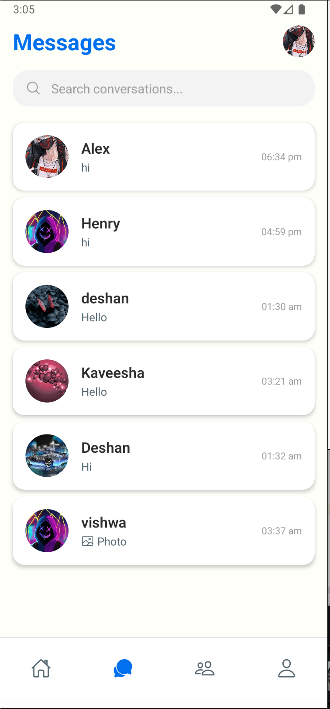
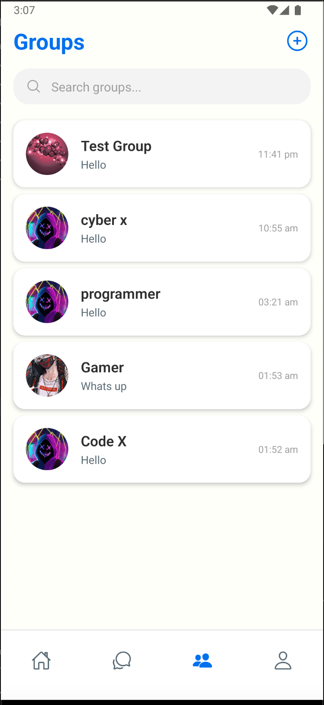
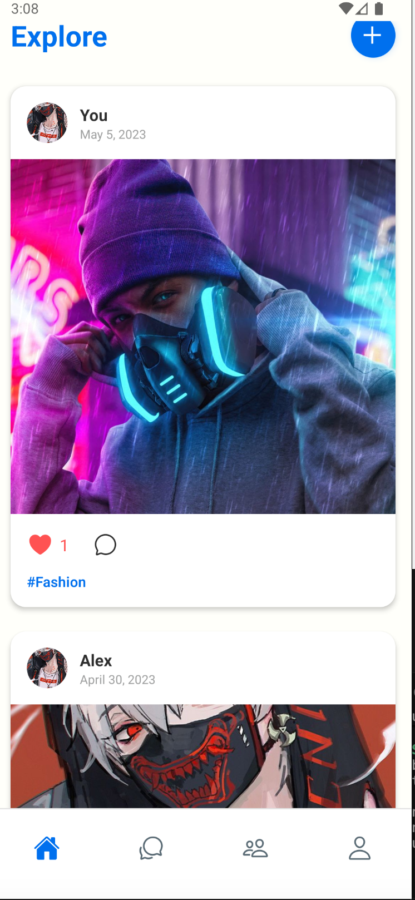
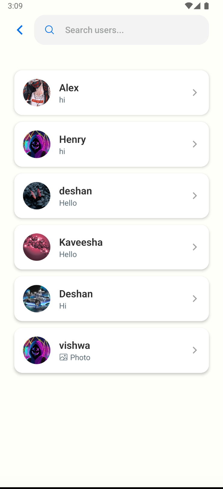

# GeoChat

GeoChat is a robust, feature-rich cross-platform mobile application designed for real-time communication and social interaction. Built with **React Native** and **TypeScript**, it offers a seamless user experience for both individual and community-driven connectivity.

## 🚀 Key Features

### 🔐 Authentication & Profile
- **Secure Onboarding**: Dedicated Sign-In and Sign-Up flows.
- **User Dashboard**: Personalized user profiles and customizable settings.
- **Identity Management**: Integrated profile image handling and status updates.

### 💬 Real-Time Messaging
- **One-on-One Chat**: Direct messaging with dynamic UI and image sharing support.
- **Group Ecosystem**: Create, search, and join communities effortlessly.
- **Member Controls**: Add users and manage group details with an intuitive interface.

### 📱 Social Ecosystem
- **Dynamic Feed**: A centralized home feed to discover and view community posts.
- **Post Creation**: Seamless workflow for uploading and sharing content.
- **Engaging Interactions**: Dedicated view for post-specific discussions and chats.

### ✨ Premium UX
- **Fluid Navigation**: Powered by React Navigation with diverse slide, flip, and fade animations.
- **Rich Visuals**: Integrated Lottie animations and R.N. Animatable for micro-interactions.
- **Native Experience**: Optimized for both iOS and Android platforms.

## 🛠 Tech Stack

- **Framework**: [React Native](https://reactnative.dev/) (v0.71.3)
- **Language**: [TypeScript](https://www.typescriptlang.org/)
- **Navigation**: [React Navigation](https://reactnavigation.org/) (Native Stack)
- **State & Storage**: [Async Storage](https://react-native-async-storage.github.io/async-storage/)
- **Animations**: [Lottie](https://airbnb.io/lottie/) & [React Native Animatable](https://github.com/oblador/react-native-animatable)
- **Utilities**: React Native Vector Icons, Image Picker, Select Dropdown

## 🏁 Getting Started

1. **Clone the repository**:
   ```bash
   git clone https://github.com/maduminu/GeoChat.git
   ```
 
2. **Install dependencies**:
   ```bash
   npm install
   ```

3. **Run the application**:
   - For Android:
     ```bash
     npm run android
     ```
   - For iOS:
     ```bash
     npm run ios
     ```

---
### Assets & Credits

Some animations used in this project are from LottieFiles (https://lottiefiles.com)

Licensed under the Lottie Simple License

All animation rights belong to their respective creators.


### This is the improve version of GeoChat that i built 2 years ago. if you want to see the old version, you can find a youtube video of it.

**this is my yotube channel link:-** https://youtu.be/rhYBYWdRIH0

### Before running the app, make sure to update the API_BASE_URL in the config.js file with your local IP address. and change the database to your local database.

## Built with ❤️ for real-time community engagement.









